# caneMultiphysics

[](https://matlab.mathworks.com/open/github/v1?repo=andreas-apostolatos/cane)

`caneMultiphysics` is a MATLAB-based research code for finite element and isogeometric multiphysics analysis developed at the Chair of Structural Analysis, Technical University of Munich. The repository contains classical FEM solvers, NURBS-based isogeometric solvers, fluid and structural dynamics coupling, contact mechanics, thermal analysis, uncertainty quantification, and shape optimization examples.

The executable examples live under [`main/`](main/). The implementation modules live beside it, for example [`FEMThermalConductionAnalysis/`](FEMThermalConductionAnalysis/), [`FEMComputationalFluidDynamicsAnalysis/`](FEMComputationalFluidDynamicsAnalysis/), [`isogeometricThinStructureAnalysis/`](isogeometricThinStructureAnalysis/), and [`MonteCarloSimulationAnalysis/`](MonteCarloSimulationAnalysis/).

## Quick Start

Start MATLAB in the `cane` repository root, then add the project to the path:

```matlab
addpath(genpath(pwd))
```

Run a single application script:

```matlab
run('main/main_FEMThermalConductionAnalysis/main_steadyStateThermalConductionAnalysis.m')
```

The [`main/`](main/) folder is the application catalog. Each subfolder groups runnable scripts by analysis area. To run another application, keep the repository on the MATLAB path and replace the path in `run(...)` with the desired script under `main/`.

## Unit Tests

The unit-test driver [`main_runUnitTests.m`](main/main_unitTests/main_runUnitTests.m) covers quadrature, utility functions, isogeometric beam and membrane analysis, Kirchhoff-Love shells, FEM thermal conduction, plate in membrane action, contact, IGA/FEM CFD, FSI, and shape optimization.

```matlab
run('main/main_unitTests/main_runUnitTests.m')
```

## Benchmark Summary

| Application area | Representative script | Output |
| --- | --- | --- |
| FEM thermal conduction | [`main_thermalConductionBenchmarks.m`](main/main_FEMThermalConductionAnalysis/main_thermalConductionBenchmarks.m) | 2 figures |
| FEM plane stress | [`main_convergenceStudyInfinitePlateWithHole.m`](main/main_FEMPlateInMembraneActionAnalysis/main_convergenceStudyInfinitePlateWithHole.m) | 4 figures |
| FEM contact mechanics | [`main_HertzConvergenceStudy.m`](main/main_FEMContactMechanicsAnalysis/main_HertzConvergenceStudy.m) | 4 figures |
| FEM incompressible CFD | [`main_steadyStateIncompressibleNavierStokesFlow.m`](main/main_FEMComputationalFluidDynamicsAnalysis/main_steadyStateIncompressibleNavierStokesFlow.m) | VTK output |
| FEM fluid-structure interaction | [`main_plotFluidStructureAndInterfaceDiscretizations.m`](main/main_FEMComputationalFluidStructureInteractionAnalysis/main_plotFluidStructureAndInterfaceDiscretizations.m) | setup and interface figures |
| FEM shape optimization | [`main_unconstrainedCFDShapeOptimizationDrag.m`](main/main_shapeOptimization/main_unconstrainedCFDShapeOptimizationDrag.m) | 2 figures |
| IGA plane stress | [`main_curvedBeamTipShear.m`](main/main_isogeometricPlateInMembraneActionAnalysis/main_curvedBeamTipShear.m) | stress field and convergence figures |
| IGA membrane with embedded cables | [`main_steadyStateDDMFourPointSail.m`](main/main_isogeometricMembraneAnalysis/main_isogeometricMembraneAnalysis_fourPointSail/main_steadyStateDDMFourPointSail.m) | benchmark driver |
| IGA Kirchhoff-Love shell | [`main_scordelisLoRoof.m`](main/main_isogeometricKirchhoffLoveShellAnalysis/main_scordelisLoRoof.m) | 3 figures |
| IGA incompressible CFD | [`main_steadyStateStokesFlowInUnitSquareDomain.m`](main/main_isogeometricComputationalFluidDynamicsAnalysis/main_steadyStateStokesFlowInUnitSquareDomain.m) | velocity field |
| Monte Carlo simulation | [`main_monteCarloSimpleBenchmark.m`](main/main_MonteCarloSimulationAnalysis/main_monteCarloSimpleBenchmark.m) | 1 figure |

## MATLAB Version

A practical minimum target is MATLAB R2015b or newer for the core examples, with the relevant domain toolboxes installed when a script asks for them. The Monte Carlo benchmark uses `parfor` and `norminv`, so it benefits from Parallel Computing Toolbox and requires Statistics and Machine Learning Toolbox for that example.

## Repository Layout

| Path | Role |
| --- | --- |
| [`main/`](main/) | Runner scripts and benchmark applications. Start here. |
| [`inputGiD/`](inputGiD/) and [`gid_cases/`](gid_cases/) | GiD model input data for FEM examples. |
| [`outputVTK/`](outputVTK/) | VTK output written by CFD and other postprocessors. |
| [`basisFunctions/`](basisFunctions/) | Classical finite element basis functions and quadrature utilities. |
| [`CAGDKernel/`](CAGDKernel/) | B-spline and NURBS geometry, refinement, base-vector, and graphics utilities. |
| [`equationSystemSolvers/`](equationSystemSolvers/) | Linear-system solvers and iterative solver wrappers. |
| [`efficientComputation/`](efficientComputation/) | Pagewise and vectorized kernels used by larger analyses. |
| [`parsers/`](parsers/) | GiD and model parsers. |
| [`unitTest/`](unitTest/) | MATLAB unit-test classes used by `main/main_unitTests`. |
| [`documentation/`](documentation/) | Public README images and project documentation. |

Main application folders:

| Path | Application area |
| --- | --- |
| [`main/main_FEMThermalConductionAnalysis/`](main/main_FEMThermalConductionAnalysis/) | FEM thermal conduction |
| [`main/main_FEMPlateInMembraneActionAnalysis/`](main/main_FEMPlateInMembraneActionAnalysis/) | FEM plane stress and membrane action |
| [`main/main_FEMContactMechanicsAnalysis/`](main/main_FEMContactMechanicsAnalysis/) | FEM contact mechanics |
| [`main/main_FEMComputationalFluidDynamicsAnalysis/`](main/main_FEMComputationalFluidDynamicsAnalysis/) | FEM computational fluid dynamics |
| [`main/main_FEMComputationalFluidStructureInteractionAnalysis/`](main/main_FEMComputationalFluidStructureInteractionAnalysis/) | FEM fluid-structure interaction |
| [`main/main_shapeOptimization/`](main/main_shapeOptimization/) | CFD shape optimization |
| [`main/main_isogeometricBeamAnalysis/`](main/main_isogeometricBeamAnalysis/) | IGA beam analysis |
| [`main/main_isogeometricPlateInMembraneActionAnalysis/`](main/main_isogeometricPlateInMembraneActionAnalysis/) | IGA plane stress |
| [`main/main_isogeometricMembraneAnalysis/`](main/main_isogeometricMembraneAnalysis/) | IGA membranes and embedded cables |
| [`main/main_isogeometricKirchhoffLoveShellAnalysis/`](main/main_isogeometricKirchhoffLoveShellAnalysis/) | IGA Kirchhoff-Love shells |
| [`main/main_isogeometricComputationalFluidDynamicsAnalysis/`](main/main_isogeometricComputationalFluidDynamicsAnalysis/) | IGA computational fluid dynamics |
| [`main/main_MonteCarloSimulationAnalysis/`](main/main_MonteCarloSimulationAnalysis/) | Monte Carlo simulation |
| [`main/main_unitTests/`](main/main_unitTests/) | Unit-test runner |

## Applications of the Finite Element Methods

### Thermal Conduction

Representative scripts:

- [`main_steadyStateThermalConductionAnalysis.m`](main/main_FEMThermalConductionAnalysis/main_steadyStateThermalConductionAnalysis.m)
- [`main_transientThermalConductionAnalysis.m`](main/main_FEMThermalConductionAnalysis/main_transientThermalConductionAnalysis.m)
- [`main_thermalConductionBenchmarks.m`](main/main_FEMThermalConductionAnalysis/main_thermalConductionBenchmarks.m)

The thermal module solves steady and transient heat-transfer problems,

$$
\rho c \frac{\partial T}{\partial t} - \nabla \cdot (k \nabla T) = Q.
$$

Benchmark script: [`main_thermalConductionBenchmarks.m`](main/main_FEMThermalConductionAnalysis/main_thermalConductionBenchmarks.m). See [1] for the finite element formulation background.

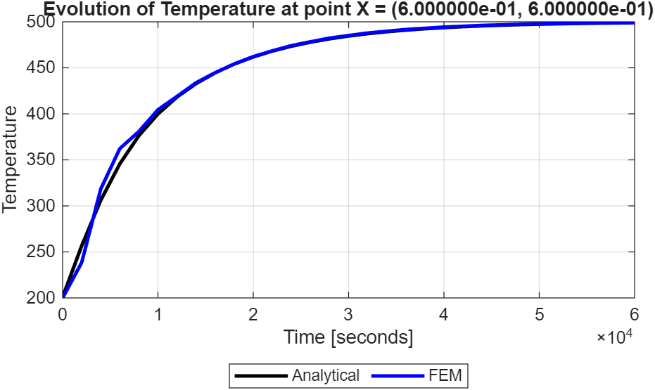

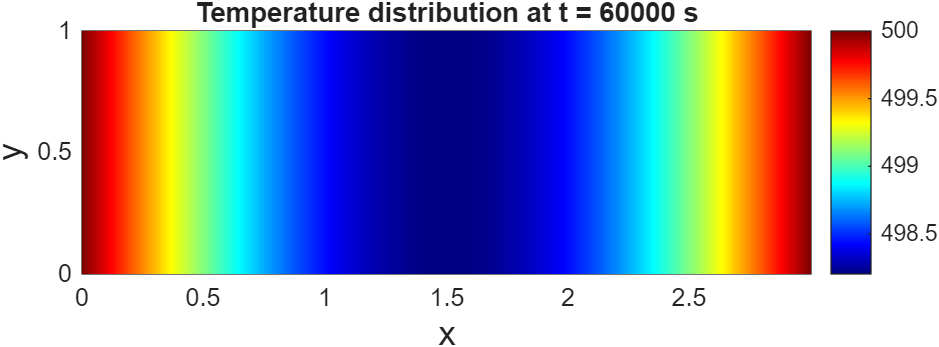

### Plane Stress: Infinite Plate With a Hole

Representative scripts:

- [`main_convergenceStudyInfinitePlateWithHole.m`](main/main_FEMPlateInMembraneActionAnalysis/main_convergenceStudyInfinitePlateWithHole.m)
- [`main_steadyStateGeometricallyLinearPlateInMembraneAction.m`](main/main_FEMPlateInMembraneActionAnalysis/main_steadyStateGeometricallyLinearPlateInMembraneAction.m)
- [`main_modalAnalysisPlateInMembraneAction.m`](main/main_FEMPlateInMembraneActionAnalysis/main_modalAnalysisPlateInMembraneAction.m)

For linear plane stress,

$$
\nabla \cdot \boldsymbol{\sigma} + \mathbf{b} = \mathbf{0}, \qquad
\boldsymbol{\sigma} = \mathbf{C} : \boldsymbol{\varepsilon}(\mathbf{u}).
$$

Benchmark script: [`main_convergenceStudyInfinitePlateWithHole.m`](main/main_FEMPlateInMembraneActionAnalysis/main_convergenceStudyInfinitePlateWithHole.m). The plotted convergence lines connect only the actual computed GiD refinement cases. See [1] for the finite element formulation background.

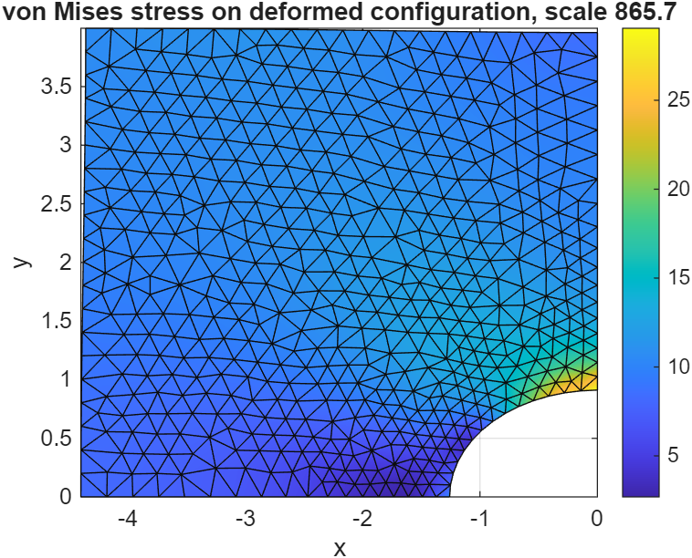

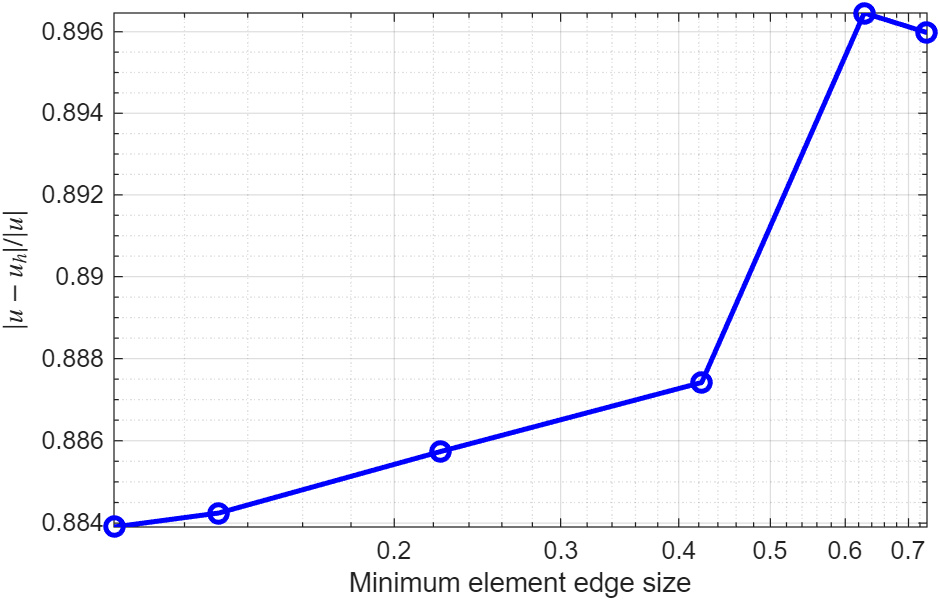

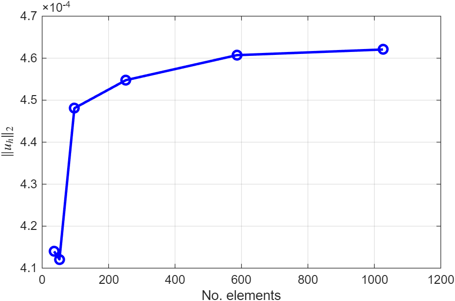

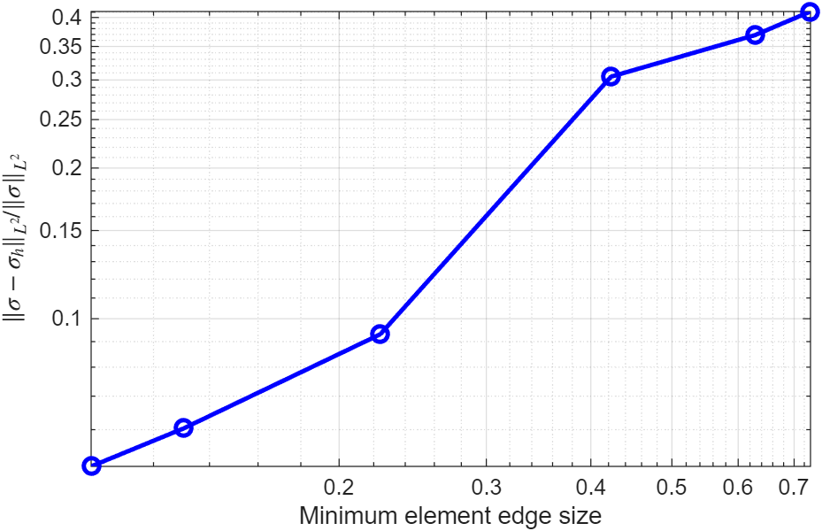

### Contact Mechanics: Hertz Benchmark

Representative scripts:

- [`main_HertzConvergenceStudy.m`](main/main_FEMContactMechanicsAnalysis/main_HertzConvergenceStudy.m)
- [`main_FEMContactLinearPlateInMembraneAction.m`](main/main_FEMContactMechanicsAnalysis/main_FEMContactLinearPlateInMembraneAction.m)

The contact module handles frictionless Signorini contact,

$$
g_n \ge 0, \qquad p_n \le 0, \qquad g_n p_n = 0.
$$

Benchmark script: [`main_HertzConvergenceStudy.m`](main/main_FEMContactMechanicsAnalysis/main_HertzConvergenceStudy.m). The circular markers are the actual GiD refinement cases and MATLAB connects them with straight line segments.

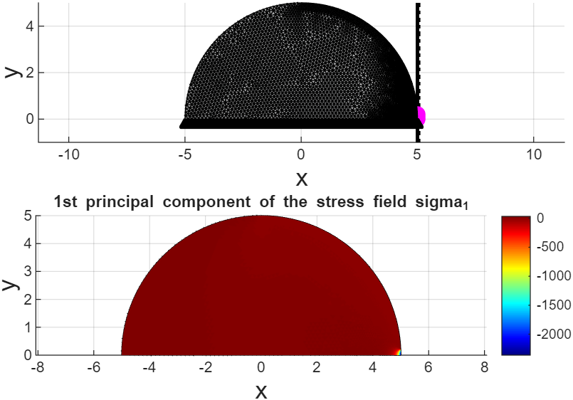

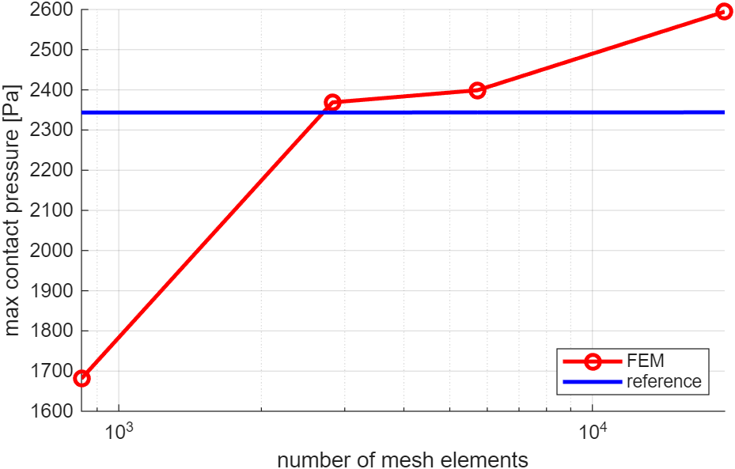

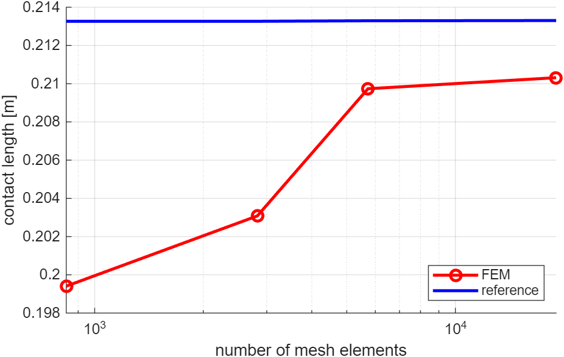

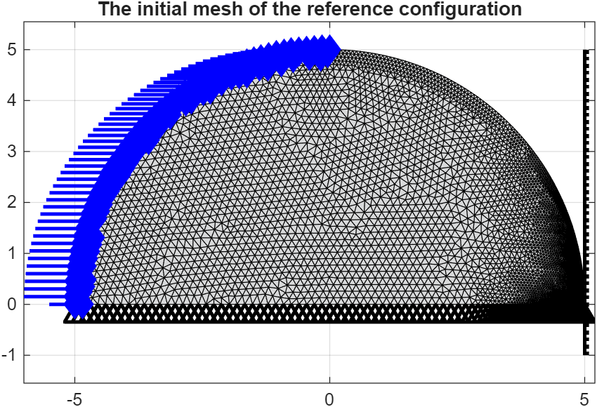

### Computational Fluid Dynamics

Representative scripts:

- [`main_steadyStateIncompressibleNavierStokesFlow.m`](main/main_FEMComputationalFluidDynamicsAnalysis/main_steadyStateIncompressibleNavierStokesFlow.m)
- [`main_transientIncompressibleNavierStokesFlow.m`](main/main_FEMComputationalFluidDynamicsAnalysis/main_transientIncompressibleNavierStokesFlow.m)
- [`main_transientNavierStokesFlowTaylorGreenVortices.m`](main/main_FEMComputationalFluidDynamicsAnalysis/main_transientNavierStokesFlowTaylorGreenVortices.m)

The FEM CFD module solves incompressible Navier-Stokes problems using a residual-based Variational Multiscale Method (VMS) [2-4]. In strong form,

```math
\rho \left(\frac{\partial \mathbf{u}}{\partial t} + \mathbf{u}\cdot\nabla\mathbf{u}\right) - \nabla \cdot \boldsymbol{\sigma} = \mathbf{f}, \qquad \nabla \cdot \mathbf{u} = 0 .
```

With test functions $\mathbf{w}$ and $q$, the resolved-scale variational problem can be written at a high level as

```math
A_\mathrm{NS}((\mathbf{w},q),(\bar{\mathbf{u}}_h,\bar{p}_h)) + A_\mathrm{VMS}((\mathbf{w},q),(\bar{\mathbf{u}}_h,\bar{p}_h)) = F(\mathbf{w}) .
```

where

```math
A_\mathrm{NS} = \left(\mathbf{w}, \rho\left(\frac{\partial \bar{\mathbf{u}}_h}{\partial t} + \bar{\mathbf{u}}_h\cdot\nabla\bar{\mathbf{u}}_h\right)\right)_\Omega + \left(\nabla\mathbf{w},2\mu\boldsymbol{\varepsilon}(\bar{\mathbf{u}}_h)\right)_\Omega - \left(\nabla\cdot\mathbf{w},\bar{p}_h\right)_\Omega + \left(q,\nabla\cdot\bar{\mathbf{u}}_h\right)_\Omega .
```

and a residual-based VMS stabilization can be expressed as

```math
A_\mathrm{VMS} = \sum_K \left(\rho\bar{\mathbf{u}}_h\cdot\nabla\mathbf{w}+\nabla q,\tau_M\mathbf{r}_M\right)_K + \sum_K \left(\nabla\cdot\mathbf{w},\tau_C r_C\right)_K .
```

The VMS split separates resolved and unresolved velocity and pressure scales,

$$
\mathbf{u} = \bar{\mathbf{u}} + \mathbf{u}', \qquad
p = \bar{p} + p',
$$

and models the unresolved scales from the momentum and continuity residuals,

$$
\mathbf{u}' \approx -\tau_M \mathbf{r}_M, \qquad
p' \approx -\tau_C r_C.
$$

Here, $\mathbf{r}_M$ and $r_C$ denote the momentum and continuity residuals on each element $K$.

Benchmark script: [`main_steadyStateIncompressibleNavierStokesFlow.m`](main/main_FEMComputationalFluidDynamicsAnalysis/main_steadyStateIncompressibleNavierStokesFlow.m). The script writes VTK output under [`outputVTK/FEMComputationalFluidDynamicsAnalysis/`](outputVTK/FEMComputationalFluidDynamicsAnalysis/).

### Fluid-Structure Interaction

Representative scripts:

- [`main_plotFluidStructureAndInterfaceDiscretizations.m`](main/main_FEMComputationalFluidStructureInteractionAnalysis/main_plotFluidStructureAndInterfaceDiscretizations.m)
- [`main_FSIFlexibleElasticStructure.m`](main/main_FEMComputationalFluidStructureInteractionAnalysis/main_FSIFlexibleElasticStructure.m)
- [`main_FSIRigidCylinderOnSpring.m`](main/main_FEMComputationalFluidStructureInteractionAnalysis/main_FSIRigidCylinderOnSpring.m)

The FSI examples combine a Navier-Stokes fluid domain, a structural domain, and an interface `Gamma_FSI` where kinematic and traction compatibility are enforced:

$$
\mathbf{u}_f = \dot{\mathbf{d}}_s, \qquad
\boldsymbol{\sigma}_f\mathbf{n}_f + \boldsymbol{\sigma}_s\mathbf{n}_s = \mathbf{0}.
$$

Benchmark script: [`main_plotFluidStructureAndInterfaceDiscretizations.m`](main/main_FEMComputationalFluidStructureInteractionAnalysis/main_plotFluidStructureAndInterfaceDiscretizations.m). See [5-7] for the Turek FSI benchmark and related FSI/interface studies produced with this code base.

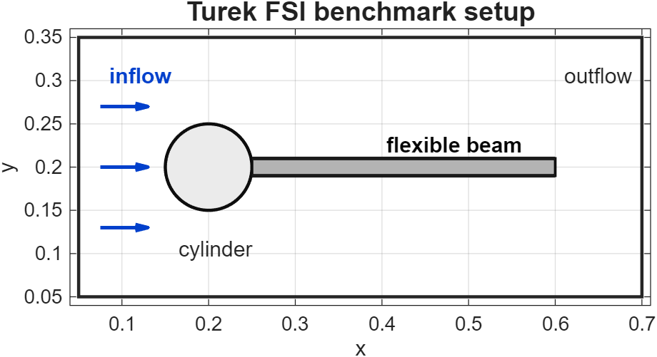

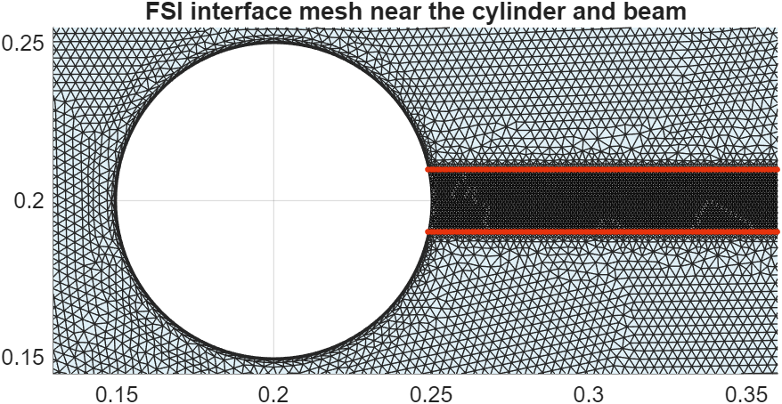

### Gradient-Based CFD Shape Optimization

Representative script:

- [`main_unconstrainedCFDShapeOptimizationDrag.m`](main/main_shapeOptimization/main_unconstrainedCFDShapeOptimizationDrag.m)

The shape optimization example minimizes drag for a 2D cylinder-flow problem by perturbing the cylinder radius,

$$
\frac{dJ}{dp} \approx \frac{J(p+\epsilon)-J(p)}{\epsilon}, \qquad
p_{k+1} = p_k - \alpha \frac{dJ}{dp}.
$$

Benchmark script: [`main_unconstrainedCFDShapeOptimizationDrag.m`](main/main_shapeOptimization/main_unconstrainedCFDShapeOptimizationDrag.m). See [8] for risk-aware CFD shape optimization work produced with this code base.

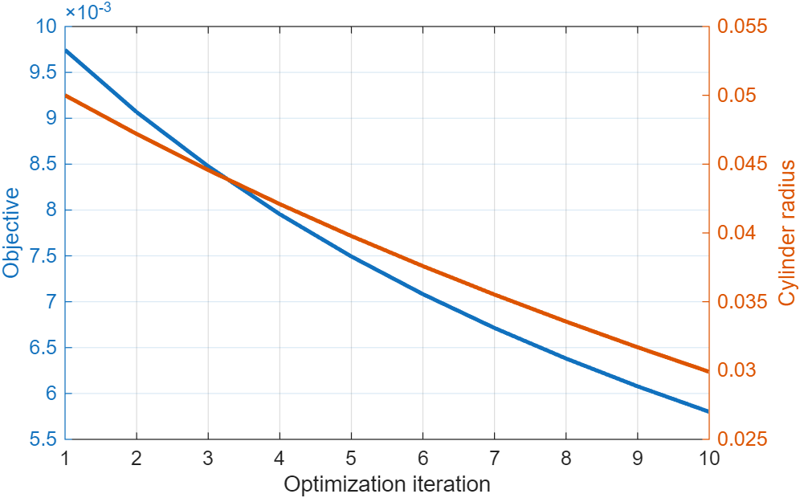

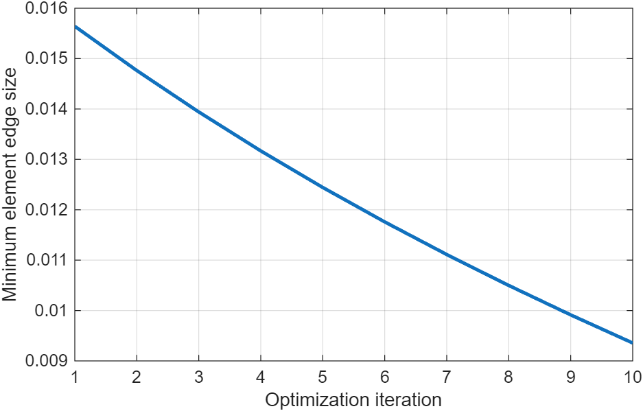

## Applications of Isogeometric Analysis

### Plane Stress: Curved Beam Under Tip Shear

Representative script:

- [`main_curvedBeamTipShear.m`](main/main_isogeometricPlateInMembraneActionAnalysis/main_curvedBeamTipShear.m)
- [`main_IGACurvedBeamTipShearConvergence.m`](main/main_isogeometricPlateInMembraneActionAnalysis/main_IGACurvedBeamTipShearConvergence.m)

This benchmark uses exact NURBS geometry for a curved beam modeled as a plate in membrane action. It compares the stress field against a closed-form reference solution. The convergence plots repeat the same analytical error computation over several h-refinement levels. Related isogeometric coupling and domain-decomposition formulations are given in [9,10].

Benchmark script: [`main_curvedBeamTipShear.m`](main/main_isogeometricPlateInMembraneActionAnalysis/main_curvedBeamTipShear.m).

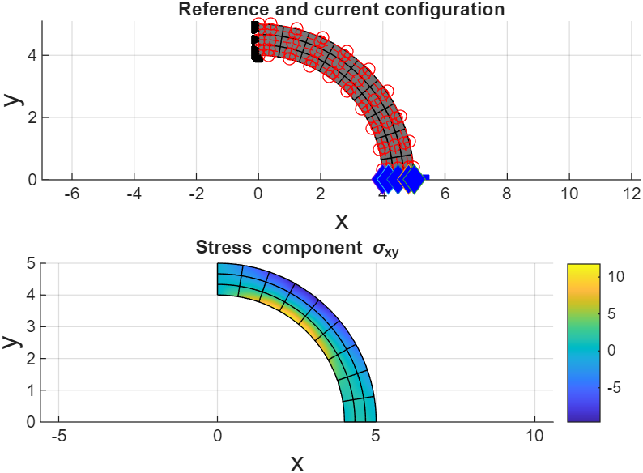

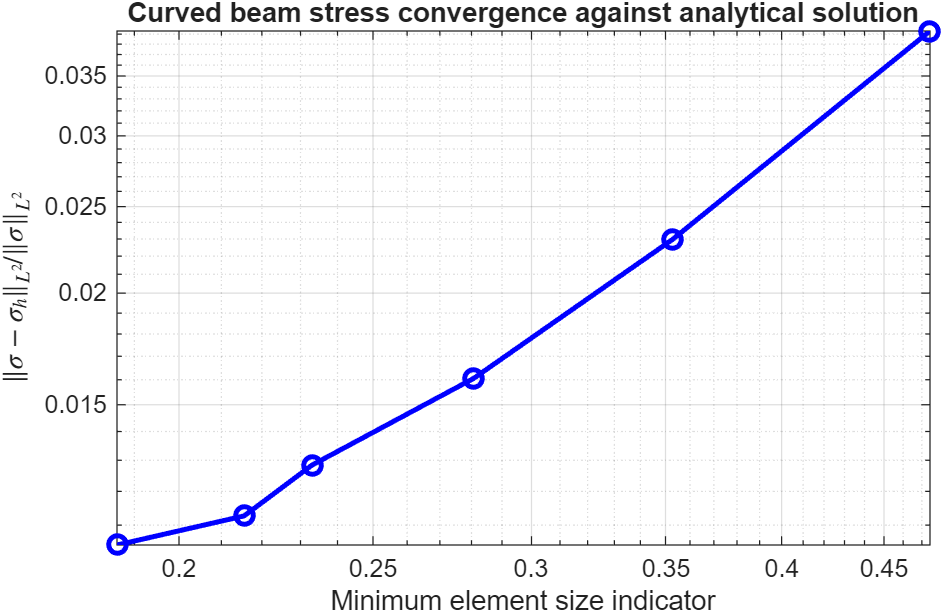

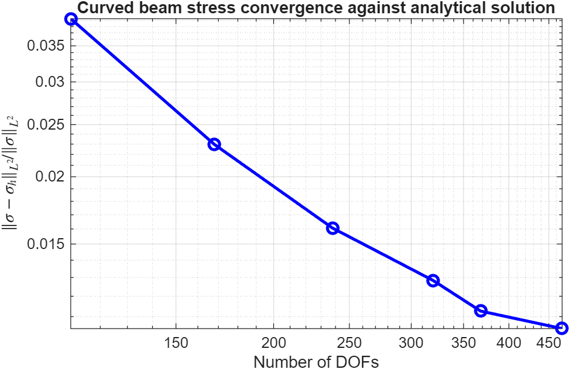

### 3D Membranes With Embedded Cables: Four-Point Sail

Representative scripts:

- [`main_steadyStateDDMFourPointSail.m`](main/main_isogeometricMembraneAnalysis/main_isogeometricMembraneAnalysis_fourPointSail/main_steadyStateDDMFourPointSail.m)
- [`main_FoFiFourPointSail.m`](main/main_isogeometricMembraneAnalysis/main_isogeometricMembraneAnalysis_fourPointSail/main_FoFiFourPointSail.m)
- [`main_modalAnalysisFourPointSail.m`](main/main_isogeometricMembraneAnalysis/main_isogeometricMembraneAnalysis_fourPointSail/main_modalAnalysisFourPointSail.m)

The membrane module covers single-patch and multipatch NURBS membranes, weak Dirichlet boundary conditions, domain decomposition, form-finding, modal analysis, transient response, and cable-coupled membrane models [9,11].

### Kirchhoff-Love Shells: Scordelis-Lo Roof

Representative scripts:

- [`main_scordelisLoRoof.m`](main/main_isogeometricKirchhoffLoveShellAnalysis/main_scordelisLoRoof.m)
- [`main_cantileverPlate.m`](main/main_isogeometricKirchhoffLoveShellAnalysis/main_cantileverPlate.m)

The shell examples use Kirchhoff-Love kinematics, where the mid-surface is represented by a NURBS surface and rotations are implied by the surface normal:

$$
\delta W_\mathrm{int} =
\int_\Omega
\left(
\delta \boldsymbol{\varepsilon}^\mathsf{T} \mathbf{n}
{}+ \delta \boldsymbol{\kappa}^\mathsf{T} \mathbf{m}
\right) \, d\Omega.
$$

Benchmark script: [`main_scordelisLoRoof.m`](main/main_isogeometricKirchhoffLoveShellAnalysis/main_scordelisLoRoof.m). The contour shows the first principal membrane stress resultant `n^1` on the geometrically nonlinear solution; the deformation is scaled for visualization. See [10,12,13] for nonlinear isogeometric shell analysis, multipatch shell coupling, and penalty-parameter studies.

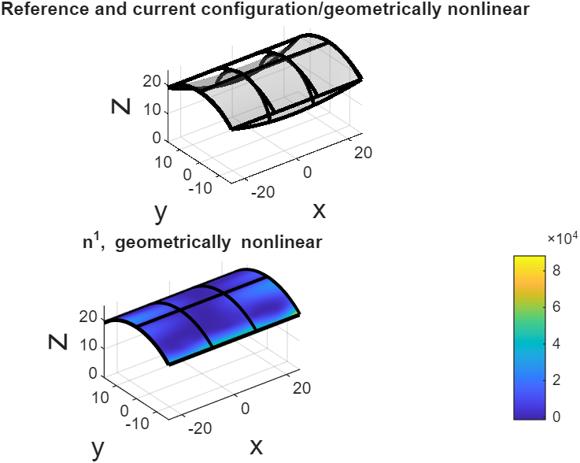

### Isogeometric Computational Fluid Dynamics

Representative scripts:

- [`main_steadyStateStokesFlowInUnitSquareDomain.m`](main/main_isogeometricComputationalFluidDynamicsAnalysis/main_steadyStateStokesFlowInUnitSquareDomain.m)
- [`main_steadyStateStokesFlowShearCavity.m`](main/main_isogeometricComputationalFluidDynamicsAnalysis/main_steadyStateStokesFlowShearCavity.m)
- [`main_transientNavierStokesFlowTaylorGreenVortices.m`](main/main_isogeometricComputationalFluidDynamicsAnalysis/main_transientNavierStokesFlowTaylorGreenVortices.m)

IGA CFD uses the same residual-based VMS idea [2-4] together with smooth NURBS spaces for velocity and pressure fields:

$$
\mathbf{x}(\boldsymbol{\xi}) = \sum_A R_A(\boldsymbol{\xi}) \mathbf{P}_A,
\qquad
R_A = \frac{N_A w_A}{\sum_B N_B w_B}.
$$

The discrete trial fields are expanded directly in the NURBS basis,

$$
\bar{\mathbf{u}}_h(\boldsymbol{\xi}) = \sum_A R_A(\boldsymbol{\xi}) \mathbf{u}_A,
\qquad
\bar{p}_h(\boldsymbol{\xi}) = \sum_A R_A(\boldsymbol{\xi}) p_A,
$$

while unresolved scales are again introduced through residual-based VMS stabilization.

Benchmark script: [`main_steadyStateStokesFlowInUnitSquareDomain.m`](main/main_isogeometricComputationalFluidDynamicsAnalysis/main_steadyStateStokesFlowInUnitSquareDomain.m).

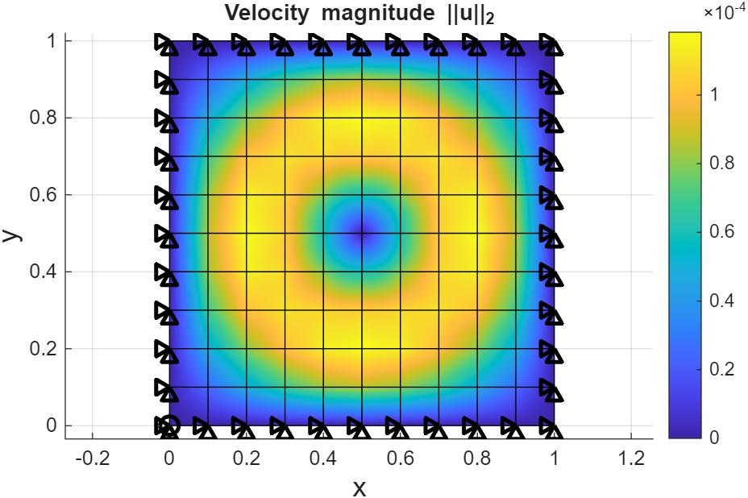

## Other Applications

### Monte Carlo Simulation

Representative scripts:

- [`main_monteCarloSimpleBenchmark.m`](main/main_MonteCarloSimulationAnalysis/main_monteCarloSimpleBenchmark.m)
- [`main_monteCarloSteadyStateFEMPlateInMembraneAction.m`](main/main_MonteCarloSimulationAnalysis/main_monteCarloSteadyStateFEMPlateInMembraneAction.m)
- [`main_monteCarloSteadyStateIncompressibleNavierStokesFlow.m`](main/main_MonteCarloSimulationAnalysis/main_monteCarloSteadyStateIncompressibleNavierStokesFlow.m)

The simple benchmark estimates statistics of

$$
Y = \exp(U), \qquad U \sim \mathcal{N}(0,1),
$$

for which the exact mean is `sqrt(e)`.

Benchmark script: [`main_monteCarloSimpleBenchmark.m`](main/main_MonteCarloSimulationAnalysis/main_monteCarloSimpleBenchmark.m). See [8] for uncertainty-aware design work connected to the stochastic-analysis functionality.

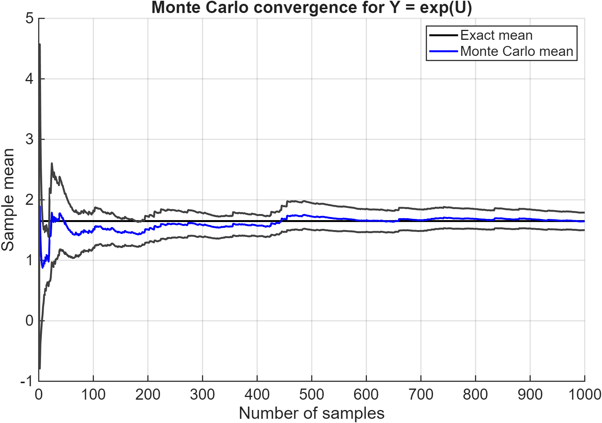

## Notes for developers

- Some scripts write VTK files under [`outputVTK/`](outputVTK/). These outputs can be inspected in ParaView.
- Several examples use GiD input models from [`inputGiD/`](inputGiD/). If a parser error appears first, check that the expected case directory exists there.

## License

`caneMultiphysics` is distributed under the BSD-style license in [`license.txt`](license.txt).

## References

[1] T. J. R. Hughes, *The Finite Element Method: Linear Static and Dynamic Finite Element Analysis*, Dover Publications, 2000.

[2] T. J. R. Hughes, "Multiscale phenomena: Green's functions, the Dirichlet-to-Neumann formulation, subgrid scale models, bubbles and the origins of stabilized methods," *Computer Methods in Applied Mechanics and Engineering* 127, 387-401, 1995.

[3] Y. Bazilevs, V. M. Calo, J. A. Cottrell, T. J. R. Hughes and A. Reali, "Variational multiscale residual-based turbulence modeling for large eddy simulation of incompressible flows," *Computer Methods in Applied Mechanics and Engineering* 197, 173-201, 2007.

[4] E. Oñate, "Derivation of stabilized equations for numerical solution of advective-diffusive transport and fluid flow problems," *Computer Methods in Applied Mechanics and Engineering* 151, 233-265, 1998.

[5] S. Turek and J. Hron, "Proposal for numerical benchmarking of fluid-structure interaction between an elastic object and laminar incompressible flow," in *Fluid-Structure Interaction*, Lecture Notes in Computational Science and Engineering 53, 371-385, 2006.

[6] [G. De Nayer, A. Apostolatos, J. N. Wood, K.-U. Bletzinger, R. Wüchner et al., "Numerical studies on the instantaneous fluid-structure interaction of an air-inflated flexible membrane in turbulent flow," *Journal of Fluids and Structures* 82, 577-609.](https://scholar.google.com/citations?view_op=view_citation&hl=de&user=wtUApdEAAAAJ&citation_for_view=wtUApdEAAAAJ:Tyk-4Ss8FVUC)

[7] [A. Apostolatos, G. De Nayer, K.-U. Bletzinger, M. Breuer and R. Wüchner, "Systematic evaluation of the interface description for fluid-structure interaction simulations using the isogeometric mortar-based mapping," *Journal of Fluids and Structures* 86, 368-399.](https://scholar.google.com/citations?view_op=view_citation&hl=de&user=wtUApdEAAAAJ&citation_for_view=wtUApdEAAAAJ:eQOLeE2rZwMC)

[8] [A. Kodakkal, B. Keith, U. Khristenko, A. Apostolatos, K.-U. Bletzinger et al., "Risk-averse design of tall buildings for uncertain wind conditions," *Computer Methods in Applied Mechanics and Engineering* 402, 115371.](https://scholar.google.com/citations?view_op=view_citation&hl=de&user=wtUApdEAAAAJ&citation_for_view=wtUApdEAAAAJ:dhFuZR0502QC)

[9] [A. Apostolatos, R. Schmidt, R. Wüchner and K.-U. Bletzinger, "A Nitsche-type formulation and comparison of the most common domain decomposition methods in isogeometric analysis," *International Journal for Numerical Methods in Engineering* 97 (7), 473-504.](https://scholar.google.com/citations?view_op=view_citation&hl=de&user=wtUApdEAAAAJ&citation_for_view=wtUApdEAAAAJ:d1gkVwhDpl0C)

[10] [A. Apostolatos, M. Breitenberger, R. Wüchner and K.-U. Bletzinger, "Domain decomposition methods and Kirchhoff-Love shell multipatch coupling in isogeometric analysis," *Isogeometric Analysis and Applications 2014*, 73-101.](https://scholar.google.com/citations?view_op=view_citation&hl=de&user=wtUApdEAAAAJ&citation_for_view=wtUApdEAAAAJ:Se3iqnhoufwC)

[11] [A. Apostolatos, K.-U. Bletzinger and R. Wüchner, "Weak imposition of constraints for structural membranes in transient geometrically nonlinear isogeometric analysis on multipatch surfaces," *Computer Methods in Applied Mechanics and Engineering* 350, 938-994.](https://scholar.google.com/citations?view_op=view_citation&hl=de&user=wtUApdEAAAAJ&citation_for_view=wtUApdEAAAAJ:UeHWp8X0CEIC)

[12] [M. Breitenberger, A. Apostolatos, B. Philipp, R. Wüchner and K.-U. Bletzinger, "Analysis in computer aided design: Nonlinear isogeometric B-Rep analysis of shell structures," *Computer Methods in Applied Mechanics and Engineering* 284, 401-457.](https://scholar.google.com/citations?view_op=view_citation&hl=de&user=wtUApdEAAAAJ&citation_for_view=wtUApdEAAAAJ:qjMakFHDy7sC)

[13] [T. Pasch, L. F. Leidinger, A. Apostolatos, R. Wüchner, K.-U. Bletzinger et al., "A priori penalty factor determination for (trimmed) NURBS-based shells with Dirichlet and coupling constraints in isogeometric analysis," *Computer Methods in Applied Mechanics and Engineering* 377, 113688.](https://scholar.google.com/citations?view_op=view_citation&hl=de&user=wtUApdEAAAAJ&citation_for_view=wtUApdEAAAAJ:4DMP91E08xMC)
